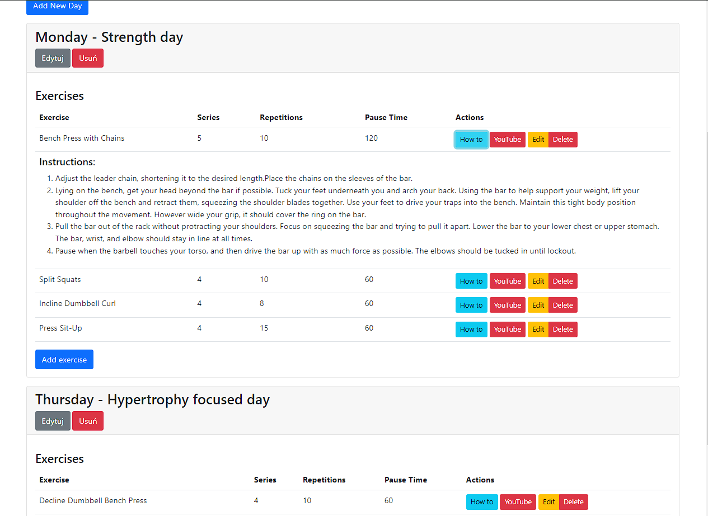
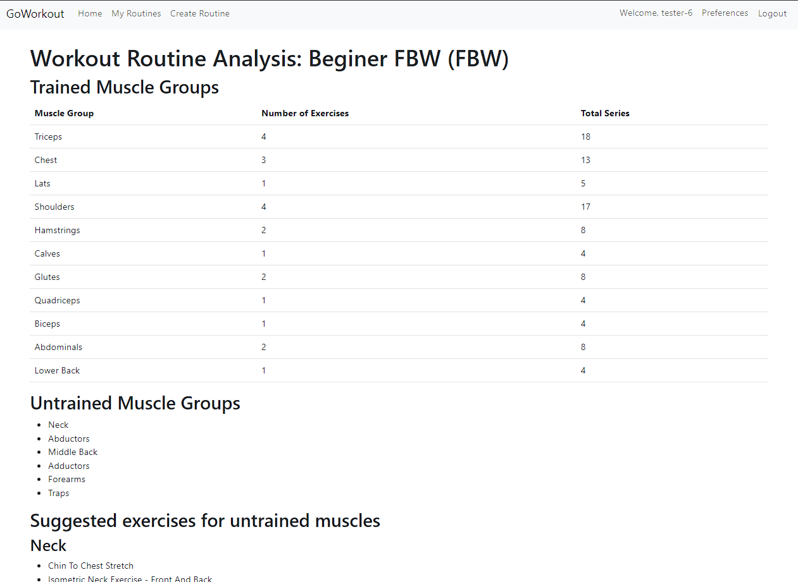
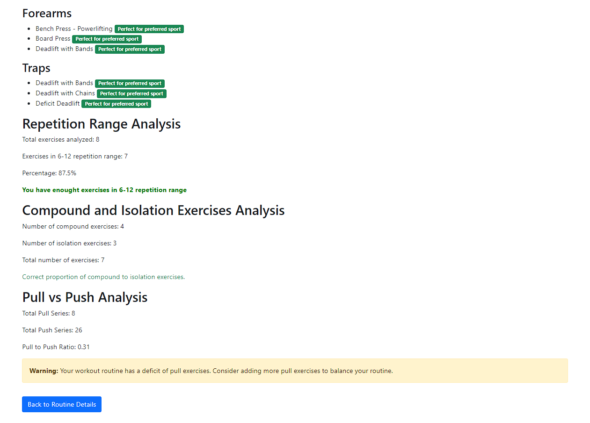

# GoWorkout - Workout Routine Planner

GoWorkout is a web application built with Django that allows users to create, manage, and track their workout routines. It provides a user-friendly interface for planning exercises, setting repetitions, and organizing workout schedules.
  


## Features

- User Registration and Authentication
- Create and manage workout routines
- Add, edit, and delete exercises within each routine
- Organize exercises by day of the week
- Track series, repetitions, and pause times for each exercise




## Technology Stack

- Backend: Django, Python
- Frontend: HTML, CSS (Bootstrap), JavaScript
- Database: PostgreSQL

## Installation

Clone the repository:
```
git clone https://github.com/JaFi01/goworkout.git
cd goworkout
```
Set up a virtual environment:
```
python -m venv venv
source venv/bin/activate  # On Windows use venv\Scripts\activate
```
Install the required packages:
```
pip install -r requirements.txt 
```

### Set up the database:

Ensure PostgreSQL is installed and running
Create a database named 'goworkout'
Update the database configuration in settings.py


Run migrations:
```
python manage.py migrate
```
Create a superuser:
```
python manage.py createsuperuser
```
Run the development server:
```
python manage.py runserver
```
Access the application at http://localhost:8000

## Usage

1. Register a new account or log in
2. Create a new workout routine
3. Add plans for different days of the week
4. Add exercises to each day's plan
5. Edit or delete exercises as needed
6. View your complete workout routine
